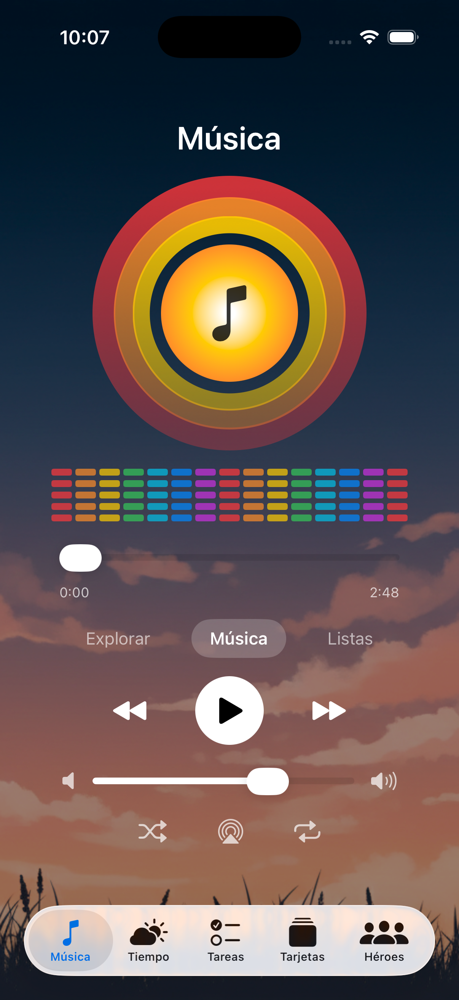
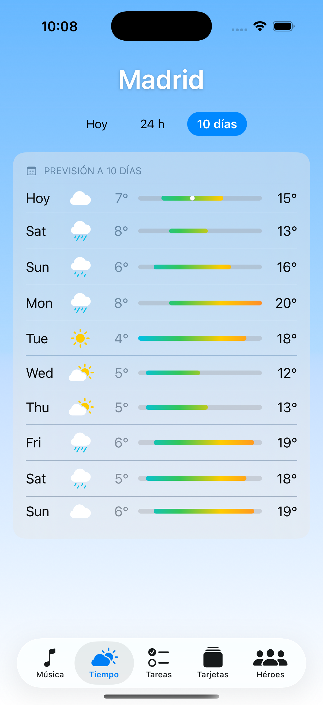
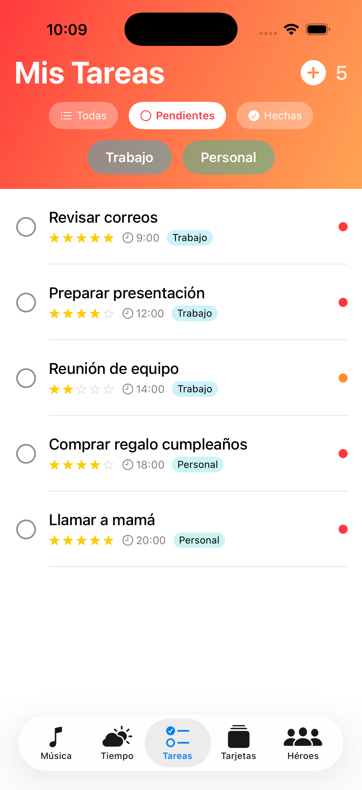
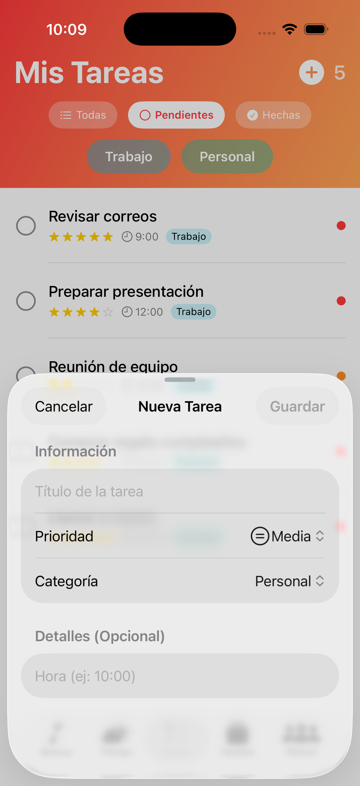
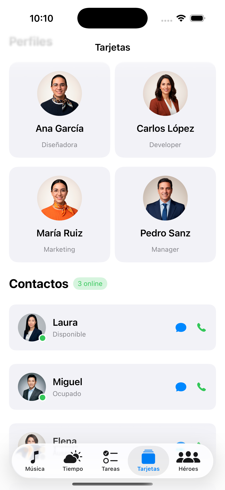
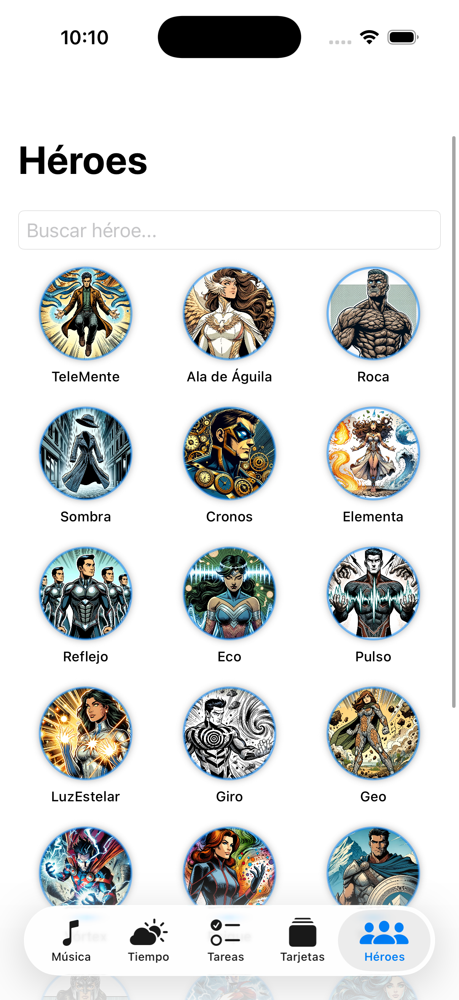
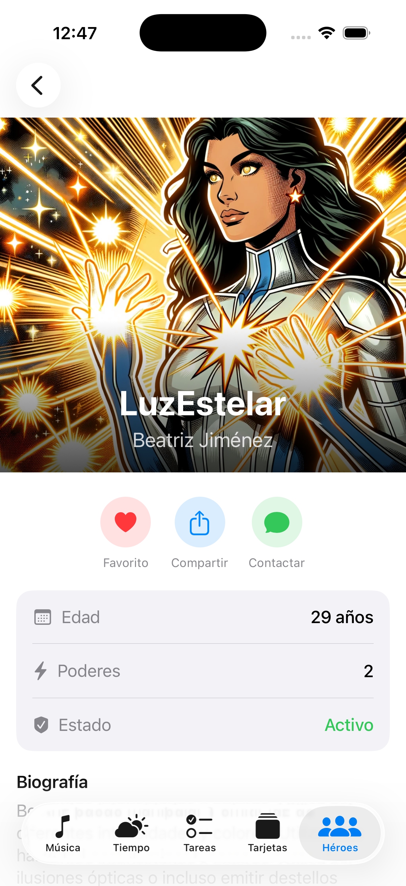

# EjerciciosUIs

<p align="center">
  
</p>

<h3 align="center">5 SwiftUI interface exercises — from music player to superhero gallery</h3>

<p align="center">
  
  
  
  
</p>

<p align="center">
  <b>Swift Developer Program 2026 — Apple Coding Academy</b><br>
  <i>Master SwiftUI components through hands-on practice</i>
</p>

---


| | Feature | Description |
|:--:|---------|-------------|
| 🎵 | **Audio Player** | AVFoundation integration with controls |
| 🌤️ | **Weather App** | Forecasts with charts and pickers |
| ✅ | **Task Manager** | CRUD operations with filters |
| 🃏 | **Card Gallery** | LazyVGrid layouts and shadows |
| 🦸 | **Heroes Catalog** | Master-detail navigation |

---


<p align="center">
  
</p>

**Reproductor de música con AVFoundation** — Imagen de fondo que cubre la parte superior con icono de música centrado. Barra de reproducción interactiva con Slider y controles de volumen. Tres botones redondos con etiquetas para navegación.

| Component | Implementation | Pattern |
|-----------|---------------|---------|
| **Play/Pause** | AVAudioPlayer control | @Observable ViewModel |
| **Progress** | Interactive Slider | State binding |
| **Volume** | System volume binding | ZStack overlay |
| **Background** | Full-screen image | ignoresSafeArea() |

---


<p align="center">
  
</p>

**App del tiempo completa** — Sol con nubes en la parte superior, temperatura con sombra sobre imagen decorativa. Tres secciones con previsión horaria en ScrollView horizontal y diaria con barras de temperatura usando ProgressView.

| Component | Implementation | Pattern |
|-----------|---------------|---------|
| **Current** | Temperature + conditions | Segmented Picker |
| **Hourly** | Horizontal ScrollView | LazyHStack |
| **Daily** | Temperature bar charts | ProgressView |
| **Picker** | Today / 24h / 10 días | pickerStyle(.segmented) |

---


<p align="center">
  
  &nbsp;&nbsp;&nbsp;
  
</p>

**Gestión de tareas con CRUD completo** — Lista con 3 botones de filtro en la parte superior y 2 de categoría debajo. Listado de elementos con diferentes configuraciones visuales según estado y prioridad. Modal sheet para añadir nuevas tareas.

| Feature | Implementation | Pattern |
|---------|---------------|---------|
| **Filters** | All / Pending / Completed | Computed properties |
| **Categories** | Work / Personal badges | Swipe actions |
| **Priority** | Color-coded indicators | Sheet modals |
| **Delete** | Swipe with confirmation | onDelete modifier |
| **Add** | Sheet modal form | @Environment dismiss |

---


<p align="center">
  
</p>

**Galería de tarjetas con componentes reutilizables** — Distintas propuestas de tarjetas y construcciones. Componentes individuales dentro de vistas únicas que luego se combinan en vistas más grandes. Imágenes circulares con información de perfil y contacto.

| Component | Implementation | Pattern |
|-----------|---------------|---------|
| **Profile Cards** | Circular images + info | LazyVGrid adaptive |
| **Contact Cards** | Icons + details | GridItem(.adaptive) |
| **Grid Layout** | Adaptive columns | Reusable components |
| **Effects** | Shadows + rounded corners | ViewModifier |

---


<p align="center">
  
  &nbsp;&nbsp;&nbsp;
  
</p>

**Catálogo de 20 superhéroes con navegación maestro-detalle** — Pantalla master con grid/list de héroes seleccionables. Pantalla de detalle con datos completos: nombreReal, apodo, descripción, edad, poderes e imagen. 31 tipos de poderes disponibles mediante enumeración.

| Feature | Implementation | Pattern |
|---------|---------------|---------|
| **Master** | Grid/List of heroes | NavigationStack |
| **Detail** | Full hero info + powers | navigationDestination |
| **Powers** | Badge collection (31 types) | ForEach + Chip |
| **Images** | Custom hero artwork | Assets catalog |
| **Data** | SuperHeroesData.swift | Global test data |

---


| Category | Technologies |
|:--------:|-------------|
| **Language** | Swift 6 |
| **UI** | SwiftUI |
| **Architecture** | Clean Architecture + MVVM |
| **Concurrency** | async/await, @MainActor |
| **Observation** | @Observable |
| **Audio** | AVFoundation |

---


| Requirement | Version |
|:-----------:|:-------:|
| iOS | 26.2+ |
| Xcode | 26.2+ |
| Swift | 6 |

---


```
EjerciciosUIs/
├── EjerciciosUIs.icon/
├── Views/
│   ├── Ejercicio1_MusicPlayer/
│   ├── Ejercicio2_Weather/
│   ├── Ejercicio3_TaskList/
│   ├── Ejercicio4_CardGallery/
│   └── Ejercicio5_Heroes/
├── ViewModels/
├── Models/
├── Resources/
├── System/
└── Assets.xcassets/
```

---


```bash
git clone https://github.com/WillToCoding/EjerciciosUIs.git
cd EjerciciosUIs
open EjerciciosUIs.xcodeproj
```

Select an iOS simulator and run with `⌘R`.

---


| Project | Description |
|:-------:|-------------|
| [**Ejercicios**](https://github.com/WillToCoding/Ejercicios) | 150+ Swift algorithm exercises |
| [**MisMangas**](https://github.com/WillToCoding/MisMangas) | Multi-platform manga collection manager |
| [**NetworkAPI**](https://github.com/WillToCoding/NetworkAPI) | Async/await networking layer |

---

<p align="center">
  <b>MIT License</b> · Made with ❤️ by <b>Juan Carlos</b>
</p>

<p align="center">
  <i>Swift Developer Program 2026 — Apple Coding Academy</i>
</p>
